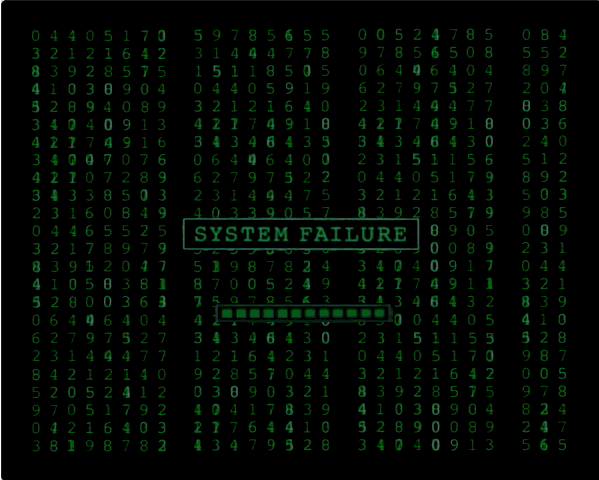

<h1 align="center">
  <br>
  
  <br>
  <br>
  Clash - A Simple Bash-Like Shell
  <br>
  <br>
</h1>

## What is Clash?

A simple Bash-like shell. Assignment instructions are [here](https://web.stanford.edu/~ouster/cgi-bin/cs190-winter19/clash.php).

## What is Bash?

Bash is a Unix shell and command language written by Brian Fox for the GNU
Project as a free software replacement for the Bourne shell. First
released in 1989, it has been distributed widely as the default login shell
for most Linux distributions and Apple's macOS (formerly OS X). A version is
also available for Windows 10. It is also the default user shell in Solaris
11.

Bash is a command processor that typically runs in a text window where the user
types commands that cause actions. Bash can also read and execute commands from
a file, called a shell script. Like all Unix shells, it supports filename
globbing (wildcard matching), piping, here documents, command substitution,
variables, and control structures for condition-testing and iteration. The
keywords, syntax and other basic features of the language are all copied from
sh. Other features, e.g., history, are copied from csh and ksh. Bash is a
POSIX-compliant shell, but with a number of extensions.

The shell's name is an acronym for Bourne-again shell, a pun on the name of the
Bourne shell that it replaces and on the common term "born again".

(From [Wikipedia – The Free Encyclopedia](https://en.wikipedia.org/wiki/Bash_(Unix_shell))).

## Quick start

Get started super quickly:

```bash
make
./clash
```

## Full usage instructions

```bash
$ ./clash --help
Clash - A Simple Bash-Like Shell

Usage:
    ./clash [options]

If no arguments are present, then an interactive REPL is started. If a single
file name argument is provided, the commands are read from that file. If a "-c"
argument is provided, then commands are read from a string.

Examples:
    Start an interactive REPL.
        ./clash

    Read and execute commands from a file.
        ./clash shell-script.sh

    Read and excute commands from a string.
        ./clash -c "echo hello world"

    Read commands from stdin.
        echo "echo hello from stdin" | ./clash
```

# License

Copyright (c) Feross Aboukhadijeh and Jake McKinnon
